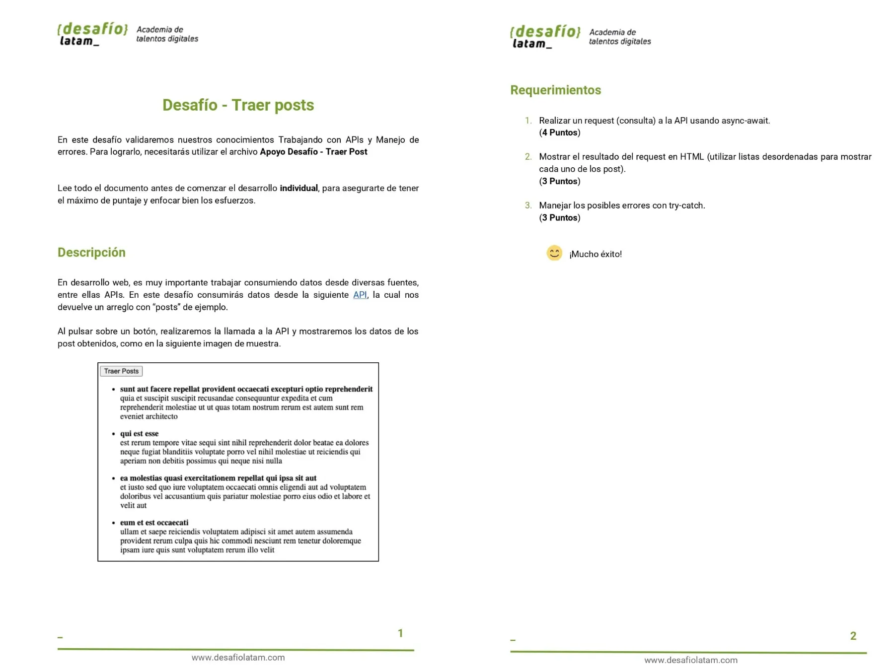
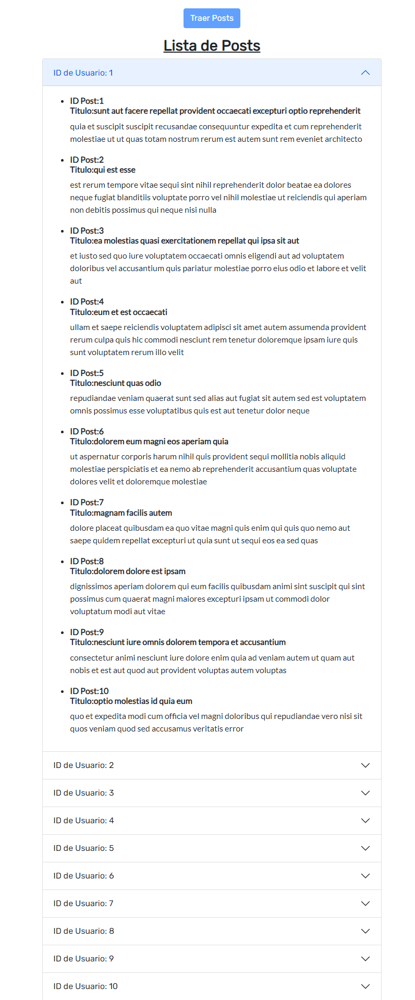
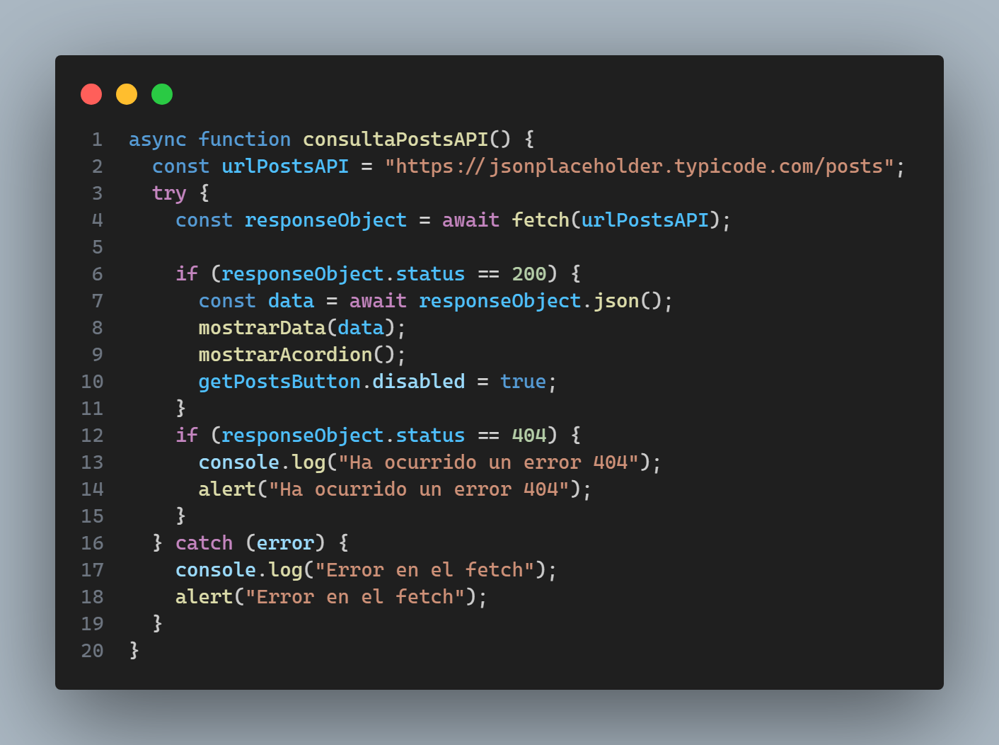
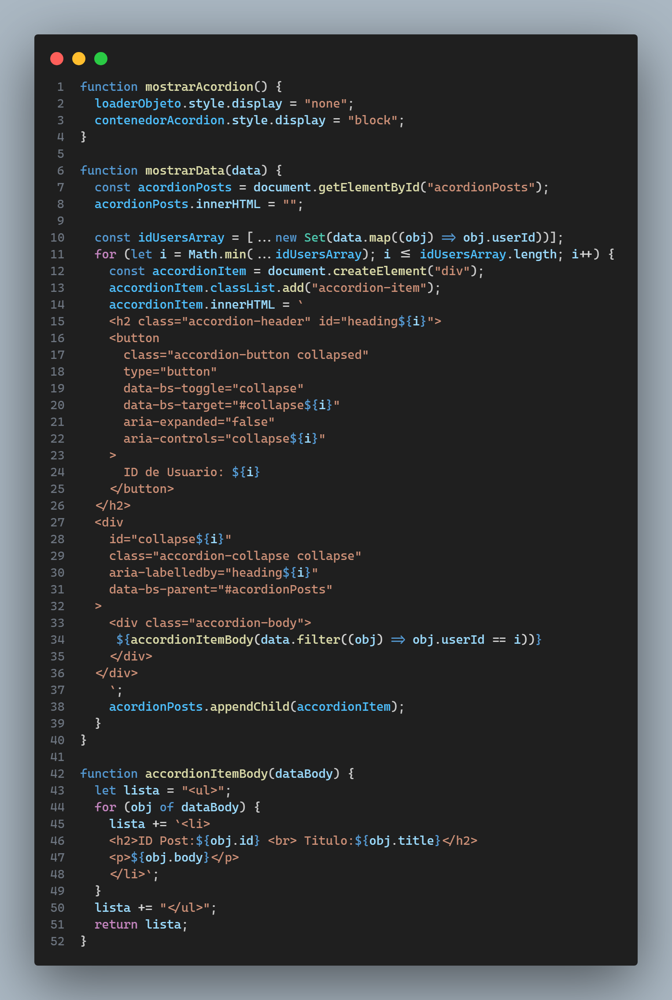

Repositorio con código del Desafío Evaluado -> **"Traer Posts"**.
Del módulo **"Programación avanzada en JavaScript"** de la beca **"Desarrollo de aplicaciones Full Stack Javascript Trainee"** dictada por Desafío Latam.

<h1>Requisitos</h1>

La API de consulta: [aquí](https://jsonplaceholder.typicode.com/posts)

Se contienen 2 estados, siendo el primero aquel que presenta el botón Traer Posts Habilitado para hacer click sobre él. 
El segundo estado, es aquel que se gatilla cuando se muestra la data en pantalla en el cual el botón Traer Posts se deshabilita. 
El estado 1 esta representado por dee sta forma:

El estado 2, el cual muestra data, se muestra de la siguiente manera:

La data de la APIs, representada en un tipo acordion de bootstrap 5.

PASOS Requisitos:

#### 1.Realizar un request (consulta) a la API usando async-await.

#### 2.Mostrar el resultado del request en HTML (utilizar listas desordenadas para mostrar cada uno de los post).

#### 3.Manejar los posibles errores con try-catch.

El manejo de errores ya sea error 404 o errores de otro tipo son manejados por un bloque de 'try y catch' que muestran una descripción del error a través de una alerta y por consola .
